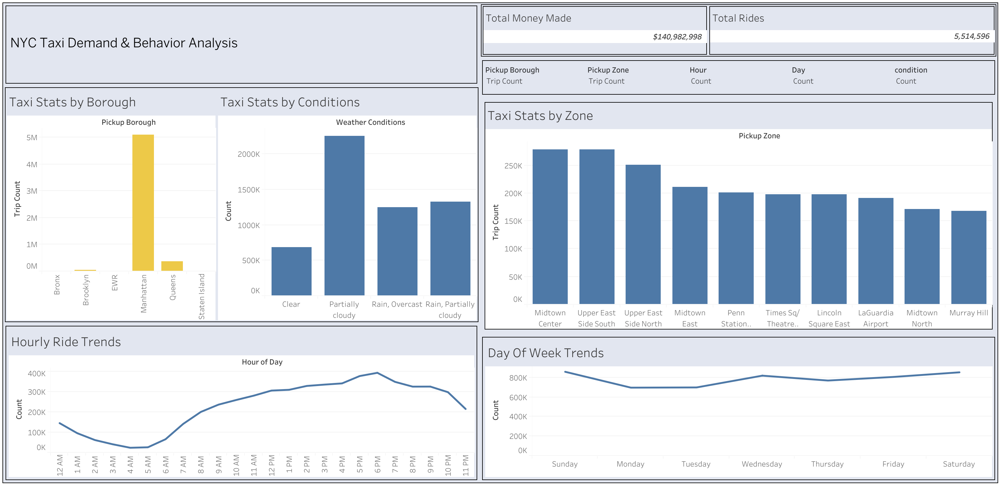

# 🚕 NYC Taxi Demand & Revenue Analysis with Machine Learning
This project explores **New York City Yellow Taxi trip data** alongside **NYC weather data** in the months of March and April. The dataset contains **over 7 million taxi trips**, providing a rich source of information on demand patterns and revenue trends.  

> Note: Only two months of data are used due to the large dataset size and computational constraints, while still capturing meaningful patterns for analysis and machine learning.
## 🔹 Key Components

- **ETL:** Clean and transform millions of taxi trip records using **SQL and Python**  
- **Exploratory Data Analysis (EDA):** Identify demand and revenue drivers with **SQL queries and Python visualizations**  
- **Visualization:** Create interactive dashboards in **Tableau**  
- **Machine Learning:** Predict taxi demand using **Linear Regression**, **Random Forest**, and **XGBoost**  
- **Deployment:** Present results via a **Streamlit web application**

## 🎯 Project Goal
Leverage NYC taxi and weather data to uncover actionable insights on ride demand and revenue patterns, and to build predictive models that support data-driven decision making.

## 🛠 Tools & Technologies  

- **SQL** – for ETL, data cleaning, aggregation, and exploratory queries  
- **Python** – for data preprocessing, feature engineering, analysis, and machine learning  
  - Libraries: `pandas`, `numpy`, `scikit-learn`, `xgboost`, `matplotlib`, `seaborn`  
  - **Machine Learning Models (using scikit-learn):**  
    - **Random Forest** – for demand and revenue prediction  
    - **Linear Regression** – to model baseline trends and relationships  
- **Tableau** – for creating interactive dashboards and visualizations of demand & revenue trends  
- **Streamlit** – to deploy a web app that presents the ML predictions

## Exploratory Data Analysis (EDA)

### Why Per-Ride vs Hourly Metrics?
To capture different perspectives of the data, we use:
- **Per-Ride Statistics (Medians):** Median values are used for fare, tip, total, trip distance, and trip duration. Medians reduce the influence of extreme values and reflect the “typical” ride experience.
- **Hourly Statistics (Averages):** Hourly averages are used to understand broader demand and revenue patterns. Averages better highlight volume-driven trends (e.g., rush hour effects, weather-driven demand shifts) even if they are skewed by extreme rides.

This dual approach ensures we identify both *what a typical ride looks like* and *how demand/revenue scale across time*.

---

### 1. Distribution Analysis
Initial examination of the dataset revealed skewed distributions in fare_amount, tip_amount, total_amount, trip_distance, trip_duration, and passenger_count. Extreme values were identified and handled using percentile-based trimming to reduce their impact on downstream analyses.

---

### 2. Pickup Zone Analysis
We analyzed the top and bottom pickup zones based on average fare, tip, total amount, and ride counts (see Figure 1).  

**Why certain zones rank high:**
- **Airports & Airport-Adjacent (JFK, LaGuardia, East Elmhurst):** Longer trips to/from Manhattan and outer boroughs, frequent tolls/surcharges, and luggage/airport travel behavior → **high median fares** and **strong tips**.  
- **Major Business & Hotel Districts (Midtown, Upper East/West Sides):** Dense ride origins/destinations all day (commuters, meetings, tourists) → **very high total revenue** via volume, even if per-ride medians are moderate.  
- **Event/Attraction Zones (Flushing Meadows–Corona Park, Randalls/Wards Island):** Periodic events/sports and limited access routes can lead to **longer average trip distances** and **higher medians** when active.  
- **Transit Hubs (Penn Station, Grand Central, Port Authority nearby zones):** Constant churn of riders throughout the day → **top totals** driven by throughput.  
- **Peripheral/Low-Access Zones (Governor’s Island, West Brighton):** Sparse population, limited taxi access, or park/industrial land use → **low ride counts** and **low totals**, even if occasional rides are long.  

> **Takeaway:** Per-ride medians highlight zones where rides are consistently expensive or tip-heavy, while totals reveal the **busiest pickup markets**. Both are needed to understand demand and revenue.  

**Figure 1: Top/Bottom 10 Pickup Zones by Median Fare, Tip, Total, and Ride Count**


---

### 3. Borough-Level Analysis
Aggregate statistics by borough show variations in median and total fare, tip, and total amounts:  

- **Queens leads on medians** (fare, tip, total) — consistent with longer average trip distances and airport-adjacent pickups (JFK/LGA).  
- **Manhattan dominates totals** — extremely high ride volume (Midtown/UES business districts, hotels, tourism, transit hubs) yields the largest **total fare/tip/total** despite lower per-ride medians than Queens.  
- **Brooklyn & Bronx** show moderate medians and much smaller totals relative to Manhattan, reflecting lower ride density.  
- **Staten Island & EWR** have very low ride counts, so borough-wide aggregates are **less insightful**; per-ride metrics are preferred here.  

**Figure 2: Borough Medians vs Totals (Fare, Tip, Total)**  

> **Why this matters:** Medians capture the “typical” ride by borough, while totals capture **scale of demand**. Low-volume boroughs can look deceptively small/large on totals; use medians for fair comparison.  


---

### 4. Weather Impact
We evaluated ride metrics across weather conditions (Clear, Partially cloudy, Rain, Overcast) both per ride and hourly:  

- **Per ride:** Metrics remain relatively stable across conditions, with fares around $12–$13 and tips around $2.7–$3.0.  
- **Hourly:** Aggregates show slightly higher revenue and ride counts during rainy periods, suggesting increased demand when weather conditions are less favorable.

**Figure 3:Weather Condition by Average Hourly Ride Count, Hourly Fare, Hourly Tips, and Hourly Total**
| Weather Condition        | Avg. Hourly Ride Count | Avg. Hourly Fare ($) | Avg. Hourly Tips ($) | Avg. Hourly Total ($) |
|--------------------------|-------------------------|-----------------------|-----------------------|------------------------|
| Clear                    | 3,565                  | 61,275               | 11,772               | 92,773                 |
| Partially Cloudy         | 3,756                  | 63,723               | 12,251               | 96,460                 |
| Rain, Partially Cloudy   | 3,690                  | 62,805               | 11,876               | 93,961                 |
| Rain, Overcast           | **4,013**              | **66,888**           | **13,054**           | **101,184**            |
---

### 5. Temporal Patterns
Hourly and daily patterns reveal:  

- **Hour-of-day effects:** Average fare, tip, and total amounts are lower in the morning and increase during evening hours. Median per-ride metrics highlight a rise in fare and total amount during morning rush hours, with tips slightly decreasing.  
- **Weekday vs Weekend:** Hourly averages show higher fare and total revenue during weekday peaks, while weekend rides have lower fare but occasionally higher tips. Daily median stats indicate gradual increases in fare and total revenue during weekdays, with weekend declines.
  
**Figure 4: Median Fare, Median Tip, Median Total, and Total Ride Count by Hour of Day**


**Figure 5: Average Hourly Fare, Average Hourly Tip, Average Hourly Total, and Average Hourly Ride Count by Day**


---

### 6. Weather vs Hourly Demand
We plotted weather features (temperature, cloud cover, windspeed, precipitation) against hourly ride count, fare, tip, and total revenue for 10 AM, 2 PM, and 8 PM to minimize rush hour and overnight effects.  

- **Observed patterns are noisy:** Weather metrics alone did not reveal stable or consistent trends in demand/revenue.  
- **Potential for interactions:** While direct patterns look weak, weather subsets tied to **specific zones** (e.g., airports, tourist attractions) or **features** (e.g., windspeed affecting bridges/ferries) may show stronger relationships.

**Figure 6: ex. Average Fare Hourly, Tip Hourly, Total Hourly, and Ride Count Hourly by Temperature**


> **Takeaway:** Weather effects appear **complex and context-dependent**. Standalone weather features may not predict demand well, but interactions with **location and time** likely hold explanatory power.  

## 🔄 ETL (Extract, Transform, Load) Process
The ETL pipeline prepares and cleans the NYC taxi dataset for analysis and machine learning. Steps include:

1. **Data Consolidation**  
   - Combined **March and April taxi trip data** into a single dataset.  
   - Merged **weather data** (temperature) and **taxi zone lookup data** for additional context.  

2. **Data Cleaning**  
   - Checked for and removed **null values** and **duplicate records**.  
   - Ensured **valid pickup and dropoff locations** (`PULocationID` and `DOLocationID`).  

3. **Outlier Handling**  
   - Applied **two-pass percentile filtering** on key variables (`fare_amount`, `tip_amount`, `total_amount`, `trip_duration`, `temperature`, `trip_distance`) to remove extreme values:  
     - **First pass:** Filtered values outside the **1st and 99th percentiles** to remove obvious errors such as negative values, really low or extreme values, and 0's.  
     - **Second pass:** Further filtered remaining values using percentiles to remove possible but extreme outliers such as trip distance that are really high with huge fare, tip, and total.  
   - The cleaned dataset was saved as a **new table**, ready for analysis and ML modeling.  

This ETL process ensures a **high-quality dataset** with realistic and reliable values for downstream EDA, visualization, and predictive modeling.

## 🤖 Machine Learning

- **Checked for Multicollinearity**  
  - Identified strong correlations among `dew`, `humidity`, and `uvindex` with variables like `temperature` and `cloudcover`.  
  - Reduced redundancy by keeping only more independent or representative features.  

- **Data Split**  
  - Used an 80/20 train-test split.  

- **Models Applied**  
  - **Linear Regression**  
    - Used as a baseline model.  
    - Performed poorly (MSE ≈ 4232.88, R² ≈ 0.11).  
  - **Random Forest Regressor**  
    - Initially showed signs of overfitting.  
    - After hypertuning, achieved strong performance.  
  - **XGBoost Regressor**  
    - Tuned to improve overall generalization.  
    - More consistent across folds compared to Random Forest.  

---

### 📊 Model Performance

**Training & Test Results (Hypertuned Models):**

| Model          | Train MSE | Train R² | Test MSE | Test R² |
|----------------|-----------|----------|----------|---------|
| Random Forest  | 100.60    | 0.979    | 163.73   | 0.967   |
| XGBoost        | 150.71    | 0.968    | 180.66   | 0.963   |

**Cross-Validation Results:**

| Model          | CV Mean MSE | CV Std Dev |
|----------------|-------------|------------|
| Random Forest  | 718.73      | 405.05     |
| XGBoost        | 678.63      | 407.50     |

---

### ✅ Key Insights
- **Linear Regression** was insufficient due to complex nonlinear patterns.  
- **Random Forest** had higher training accuracy but required hypertuning to reduce overfitting.  
- **XGBoost** showed slightly lower accuracy than Random Forest on test data, but performed better during **cross-validation**, meaning it was more consistent across different folds.  
- **Final Choice**: XGBoost was selected as the most reliable model due to its balance of performance and consistency.  


## 📊 Tableau Dashboard

[](https://public.tableau.com/views/nyctaxi_17563542895860/Dashboard1?:language=en-US&:sid=&:redirect=auth&:display_count=n&:origin=viz_share_link)

## 🚀 Deployment

- Built an **interactive prediction tool** using Streamlit.  
- Users can input features such as **day, hour of day, pickup location, temperature, precipitation, windspeed, and cloudcover**.  
- The app uses the **tuned XGBoost model** to predict the expected **ride count**.  
- This deployment demonstrates how machine learning models can be integrated into a simple, user-facing product for real-time predictions.  
- Run the app locally with:  

```bash
streamlit run app.py

  
